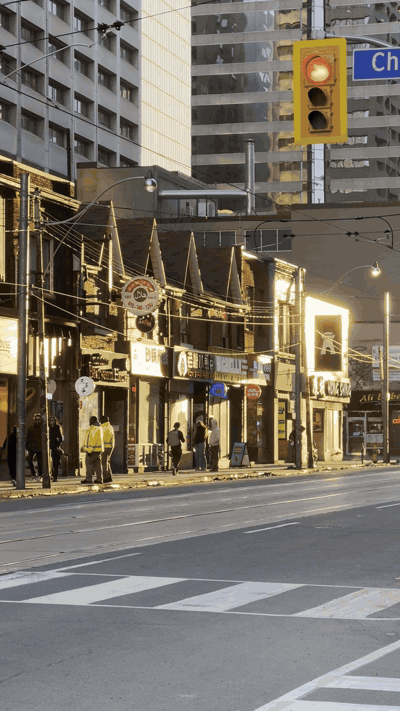
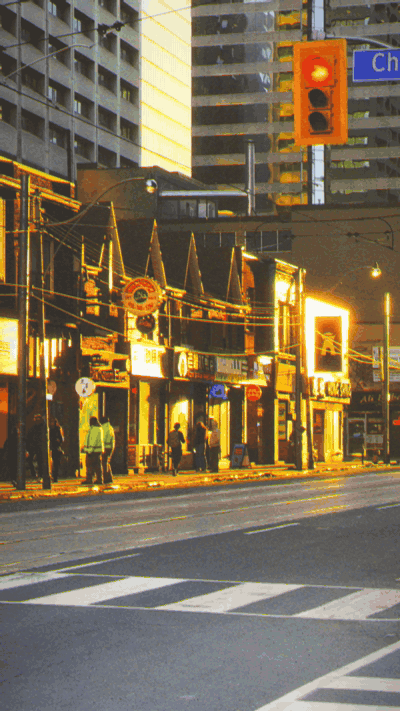
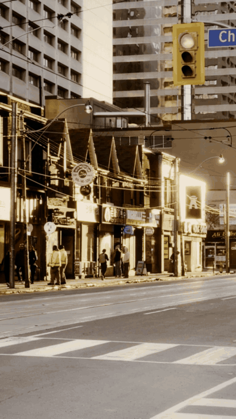

# Vintage Video

Turn modern smartphone footage into something that looks like it was shot decades ago — not with Instagram filters, but by actually simulating what the recording medium did to the image.

Each mode models a real physical process: the chemistry of film emulsion, the electromagnetic properties of magnetic tape, the optics of old lenses and projectors. The goal isn't "add a color grade." It's "what would this footage actually look like if it had been captured and played back on that technology?"

## The Modes

### Original


Your clean, digitally stabilized, 4K smartphone footage. Sharp, smooth, perfect — and completely soulless in that modern phone camera way.

### Silent — 1910s Orthochromatic Film


This one goes way back. Orthochromatic film couldn't see red light, so skin tones go pale and lips disappear while blue skies turn white. The carbon arc projector flickers at semi-random intervals (it's running on early AC power with an unstable arc gap). A hand-crank operator controls the speed, so playback drifts — sometimes faster, sometimes slower, with a Brownian walk that feels human rather than mechanical.

The grain uses Soft Light blending so it's most visible in the midtones and fades naturally in pure black and white, like real silver halide crystals. Scratches wander across the frame following their own random walks, and the iris vignette isn't a perfect circle — it has Fourier perturbations because real camera apertures weren't machined to mathematical perfection.

The sepia tone isn't decorative. It's what happens when you tone silver prints — the chemical process replaces metallic silver with silver sulfide, which shifts the image toward warm brown.

### Golden — 1950s Technicolor


Technicolor's 3-strip process was wild. Three separate strips of black-and-white film ran through the camera simultaneously, each behind a different color filter, and then dye transfers from each negative were combined onto a single print. The result was those impossibly vivid Wizard-of-Oz colors that no other process could match.

The color science here uses the Baselight crosstalk-removal approach — the same math used in professional color grading to reverse-engineer the Technicolor look. A crosstalk-removal matrix removes the green contamination that modern cameras capture but Technicolor's optical system didn't, producing that distinctive color separation where reds are *red* and blues are *blue* without the muddy overlap.

Because three separate negatives were involved, each had its own grain pattern and slight registration errors. You can see this as subtle color fringing at edges — the RGB channels don't quite line up, shifting independently frame to frame on Brownian walks. The grain is also independent per channel, three separate noise fields rather than one.

The bloom is warm because Technicolor projection pushed light through dye layers that absorbed more blue than red, so bright areas glow with a warm halo. The halation comes from light scattering through the emulsion and bouncing off the film base — it shows up as a warm glow around highlights.

### VHS — 1990s Tape


This one took the most iteration to get right, because VHS doesn't just look "soft" — it looks *cheap* in a very specific way.

The pipeline starts by crushing the dynamic range. Real VHS has milky blacks and compressed whites because the tape physically can't hold the full brightness range. Blacks never hit true black; whites bloom before they get to full white. This contrast reduction is actually the single biggest difference between "digital video with a blur" and "actual tape."

Then comes the signal processing. VHS records in YIQ color space (the NTSC standard), and the luma channel gets about 2.5 MHz of bandwidth while chroma gets a pathetic 500 kHz. In practice, this means brightness detail is soft but chrominance is absolutely smeared — colors bleed horizontally across the frame in a way that's distinctly different from just blurring the whole image. We apply IIR Butterworth filters at these exact cutoff frequencies, which naturally produce the edge ringing (overshoot on brightness transitions) that VHS is known for.

On top of that bandwidth limiting, VCRs had built-in sharpening circuits that tried to compensate for the softness. This creates a paradox that's key to the VHS look: the image is simultaneously soft (low bandwidth) AND has bright/dark halos around edges (from the sharpening). Most VHS effects miss this entirely.

The interlacing is essential. VHS is natively 480i — each frame is two fields captured at different moments. When something moves, you get combing artifacts where the even and odd scanlines show the object in slightly different positions. This is immediately recognizable as "video" rather than "film" and it's completely absent from progressive digital footage.

The camcorder shake breaks the digital stabilization. Real VHS camcorders had no optical or electronic stabilization, so handheld footage has a characteristic low-frequency wobble. The hue instability ("Never The Same Color" — the old joke about NTSC) comes from the color-under recording process introducing slight phase errors frame to frame.

Head-switching noise at the bottom of the frame, timebase jitter giving scanlines slight horizontal wobble, occasional tape dropouts — these are all modeled as stochastic processes rather than static overlays.

### Cinematic — Modern Film (Vision3 500T)


This models what happens when you shoot on Kodak Vision3 500T negative stock and print onto 2383 print film — the standard Hollywood photochemical pipeline that was used for most theatrical releases before the digital transition.

The conversion uses `spectral_film_lut`, a library that models the actual spectral sensitivity curves and dye densities of real film stocks. It's not a color LUT approximation — it computes what each wavelength of light does to each emulsion layer, accounting for spectral crosstalk between layers, the Hurter-Driffield characteristic curve of each stock, and the color temperature of both the taking light and the projection lamp.

The highlight soft-clip is film's most important visual signature. Digital sensors hard-clip to pure white; film compresses highlights smoothly along a shoulder curve. A bright window in digital footage is a blown-out white rectangle. On film, it rolls off gracefully, holding detail and color even in extreme highlights. We apply this as the very first step — before color conversion — using a soft-knee curve that starts compressing around 70% brightness.

Halation is physically accurate: light passes through the emulsion layers (which are stacked Blue-Green-Red from lens to base), hits the film base, bounces back, and scatters. Because red is the deepest layer (closest to the base), halation is predominantly red/warm — that's why film highlights glow warm rather than cool.

The grain is independent per frame (alpha=0 temporal coherence, unlike VHS which has sticky grain) because each frame of film is a completely independent exposure of silver halide crystals. It's also exposure-dependent — grain is most visible in midtones, less in deep shadows (where there's little exposure) and highlights (where heavy exposure produces smoother density). When the spectral film library is available, we use its actual grain model; otherwise we approximate with a luminance-response curve.

Film breath — the subtle per-frame exposure variation from gate flutter and developing inconsistencies — uses low-frequency sinusoidal oscillation so the brightness drifts gently rather than jumping randomly. Gate weave is Brownian, reflecting the mechanical reality of a film transport mechanism where the current position depends on the previous position.

## How It Works

The processor reads video frames through ffmpeg pipes (no temp files, no quality loss from intermediate encoding), processes each frame through the selected mode's pipeline, and writes directly to the output encoder. Audio is passed through — or in VHS mode, degraded with bandpass filtering and echo to simulate the linear audio track.

Each mode is a class with a `process_frame(frame, frame_idx)` method. Stateful effects (gate weave, flicker, grain temporal coherence, camcorder shake) are initialized once and evolve frame to frame, so they're temporally coherent rather than randomly regenerated.

The processing happens at native resolution for film modes but downscales to 720x480 for VHS (real NTSC resolution) before applying effects, then upscales back. This means the VHS softness comes from both the bandwidth limiting AND the resolution loss, just like real tape.

## Usage

```bash
python vintage_video.py input.mp4 --mode silent
python vintage_video.py input.mp4 --mode golden -o output.mp4
python vintage_video.py input.mp4 --mode vhs --intensity 0.8
python vintage_video.py input.mp4 --mode cinematic --seed 42
```

**Options:**
- `--mode` — `silent`, `golden`, `vhs`, `cinematic` (default: cinematic)
- `--intensity` — Effect strength, 0.0 to 2.0 (default: 1.0)
- `--fps` — Output framerate (default: auto, silent defaults to 18fps)
- `--seed` — Random seed for reproducibility
- `-o` — Output path (default: `input_MODE.mp4`)

## Dependencies

```bash
pip install numpy scipy opencv-python
# Optional, for accurate film stock simulation in cinematic mode:
pip install spectral-film-lut
```

Requires `ffmpeg` in your PATH for video I/O.

## The Iteration Process

This project went through several rounds of "that's technically correct but doesn't look right." The first versions had all the right signal processing but the effects were too subtle — you had to squint to see the difference from the original. Turns out, vintage media was *obviously* different from modern digital. VHS didn't look like "slightly warm video." It looked like garbage, and that garbage had character.

The breakthrough for VHS was realizing that the missing ingredient wasn't more sophisticated signal processing — it was the crude stuff. Crushing the contrast range, adding camcorder shake, simulating interlacing. The things that made VHS feel *cheap*. The bandwidth limiting and chroma smear are technically important, but they're not what your brain latches onto when it recognizes "that's a VHS tape."

For Golden and Cinematic, the issue was the opposite: the color science was good but there was no *texture*. Film has grain you can see on pause, halation that glows around every window, softness from lenses that weren't designed by computers. Cranking these up from "technically present" to "visually obvious" made the difference between "nice color grade" and "that was shot on film."
